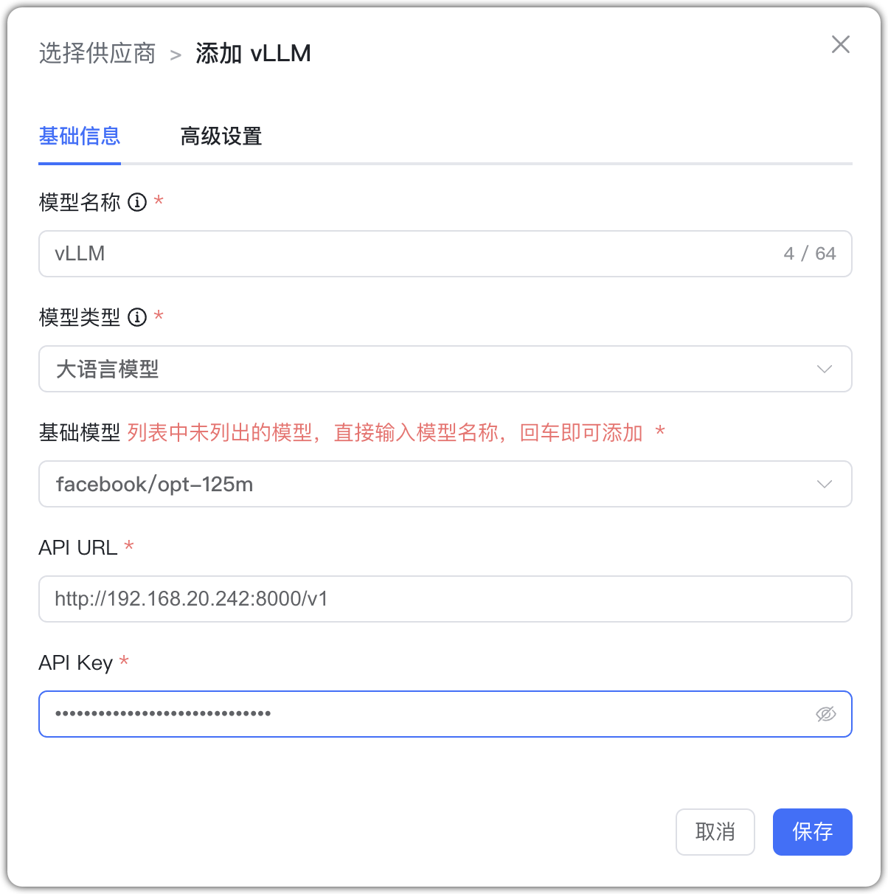
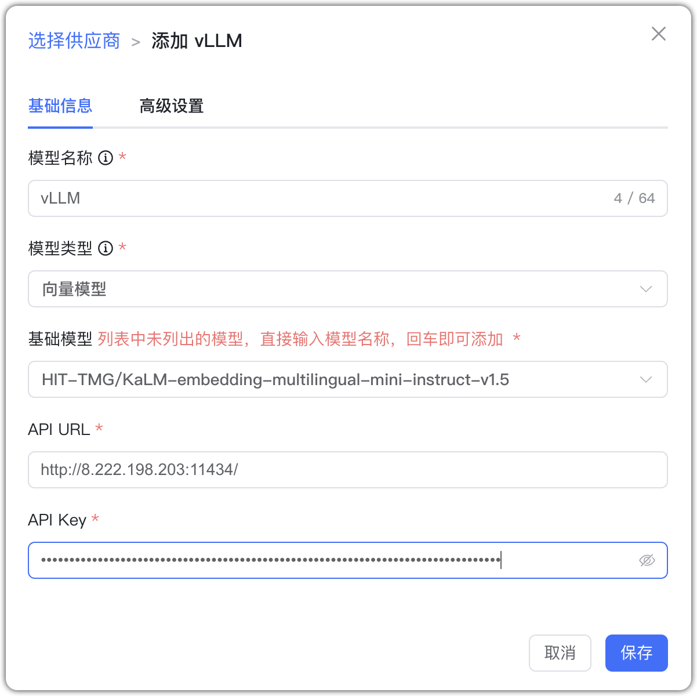
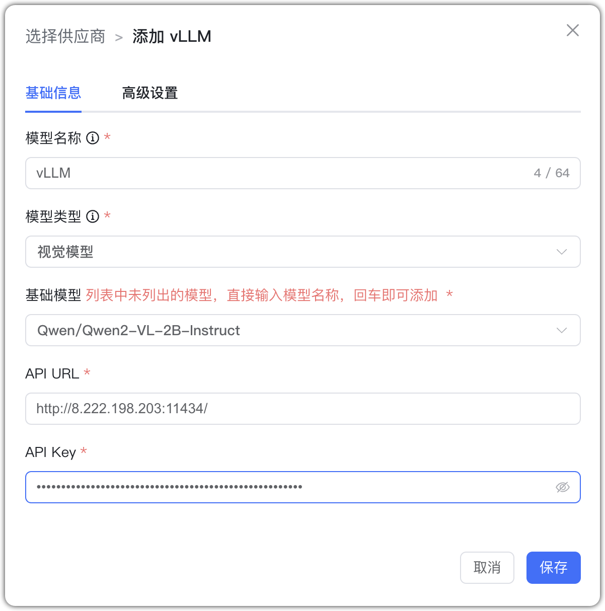

## 1 Добавление модели

!!! Abstract ""
    Выберите провайдера `vLLM` и заполните параметры:

    * Имя модели: произвольное имя в MaxKB.
    * Тип модели: LLM/эмбеддинги/визуальная.   
    * Базовая модель: имя модели (можно ввести своё).      
    * Домен API: адрес сервиса vLLM, например: http://192.168.20.242:8000/v1. 
    * API Key: можно указать произвольное значение, если ключ не используется.

## 2 Примеры конфигурации

!!! Abstract ""
    vLLM — пример LLM:

{ width="500px" }

!!! Abstract ""
    vLLM — пример эмбеддингов:

{ width="500px" }

!!! Abstract ""
    vLLM — пример визуальной модели:

{ width="500px" }