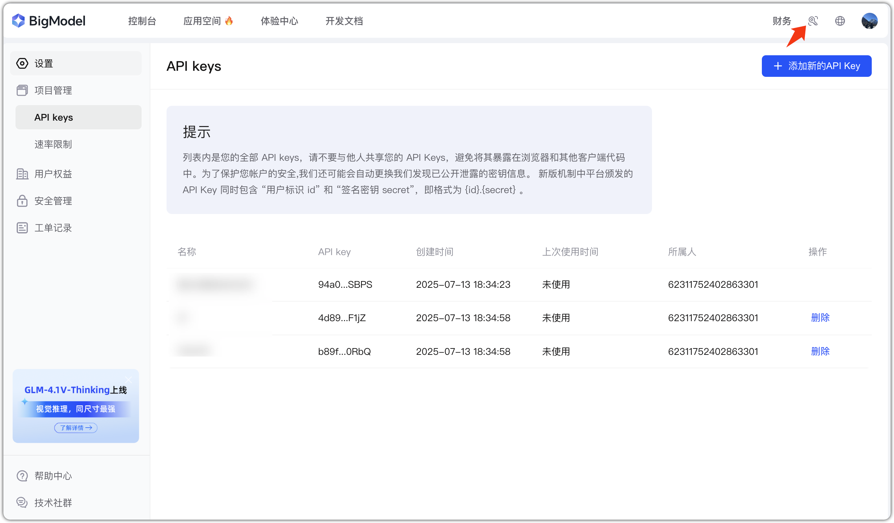
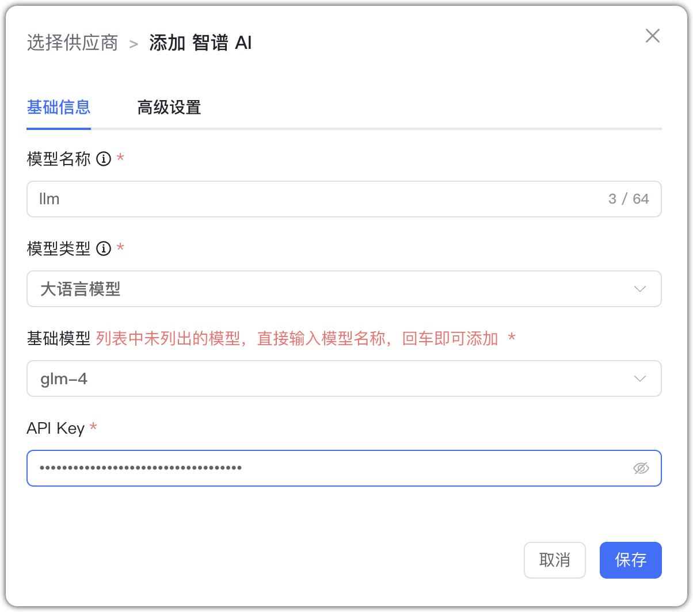
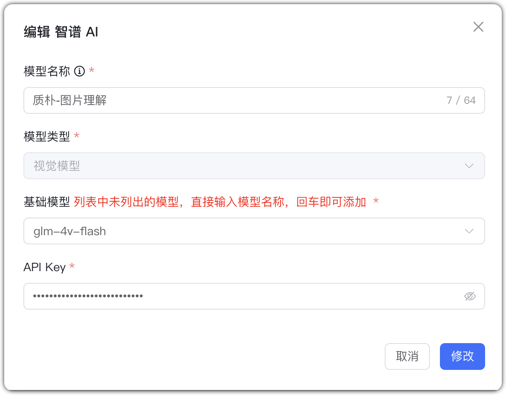
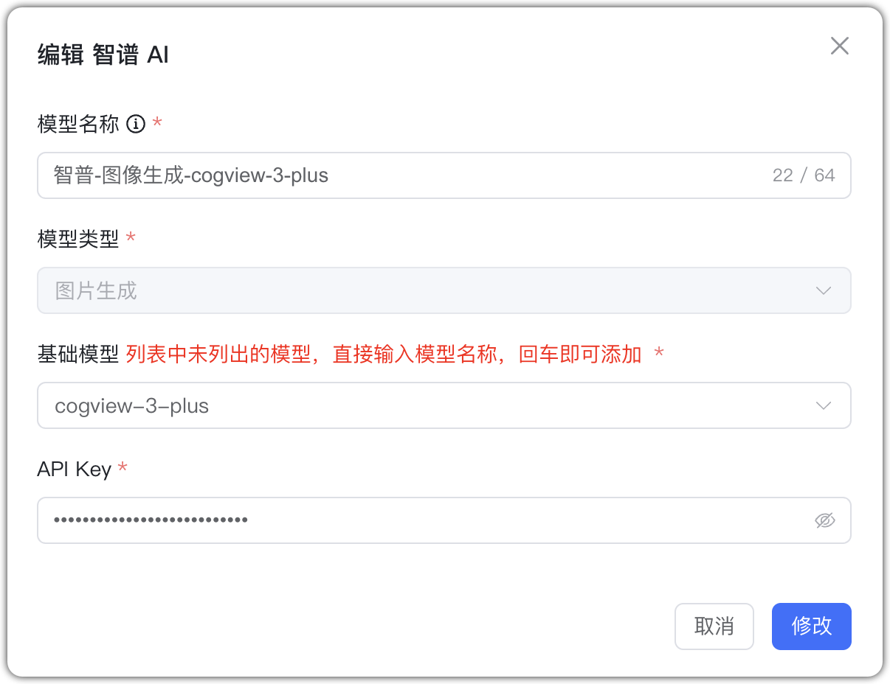
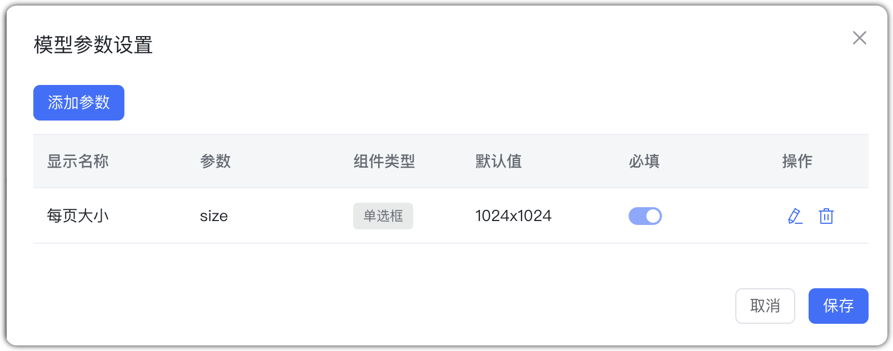

## 1 Добавление модели

Перед добавлением модели Zhipu AI зарегистрируйтесь и создайте API Key на [платформе Zhipu AI](https://open.bigmodel.cn/).

Выберите провайдера `Zhipu AI` и заполните параметры:

* Имя модели: произвольное имя в MaxKB.
* Тип модели: LLM/визуальная/генерация изображений.   
* Базовая модель: имя модели; можно ввести своё.    
* API Key: ключ, созданный на платформе Zhipu AI.

## 2 Примеры конфигурации

Zhipu AI — пример LLM:

{ width="500px" }

Zhipu AI — пример визуальной модели:

{ width="500px" }

Zhipu AI — пример генерации изображений:

{ width="500px" }

{ width="500px" }