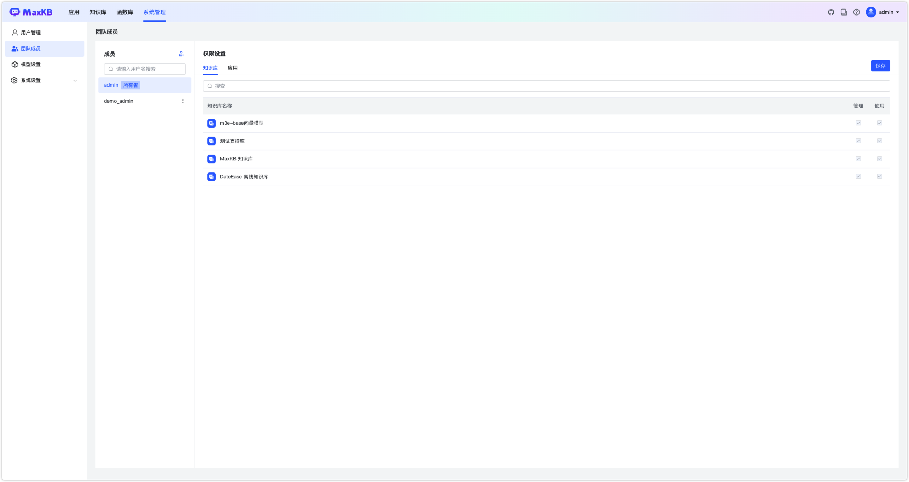
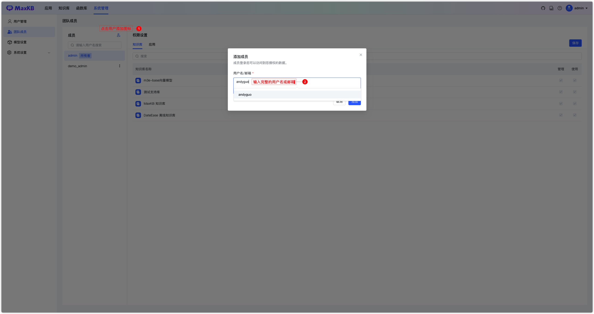
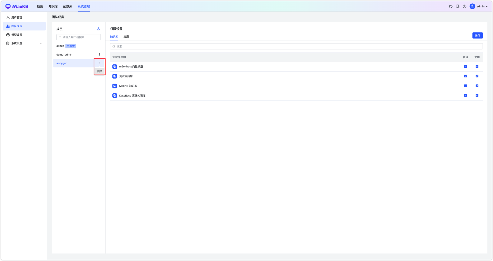

# Управление командой

В MaxKB поддерживается совместная работа над базами знаний и приложениями. Есть роли «владелец» и «участник»: создатель БЗ/приложения — владелец, добавленные пользователи — участники. Владелец может добавлять и удалять участников.    
**Примечание: в коммьюнити‑версии максимум 1 участник команды.**      

## 1 Добавление участника

Нажмите «Добавить участника» и укажите его имя пользователя или email.   
**Важно:** добавляемый участник должен существовать в системе.  

## 2 Настройка прав

После добавления участника назначьте права на базы знаний и приложения. 

* Администрирование: управление соответствующими ресурсами. 
* Использование: только просмотр соответствующих ресурсов.    

Нажмите «Сохранить», чтобы применить.

## 3 Удаление участника

В списке участников нажмите «…» → «Удалить». Пользователь потеряет все права.

