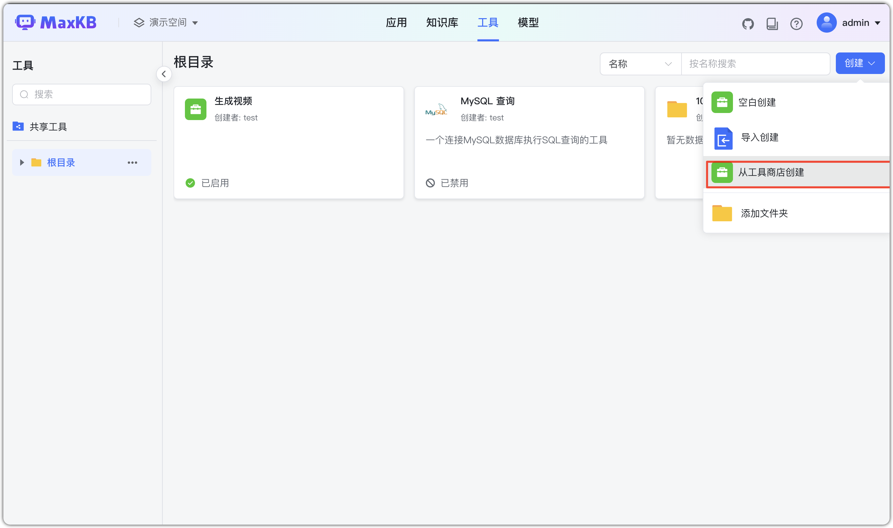
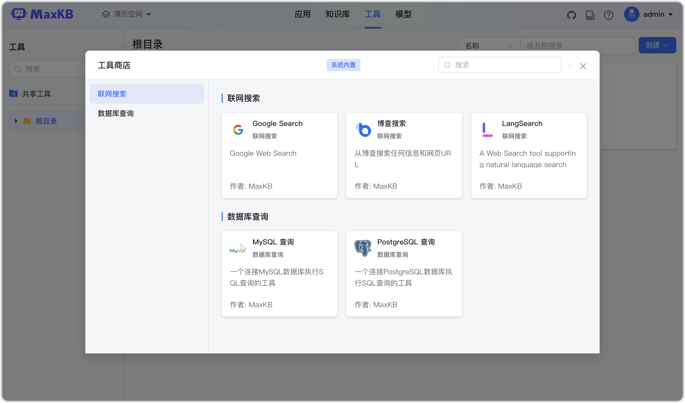
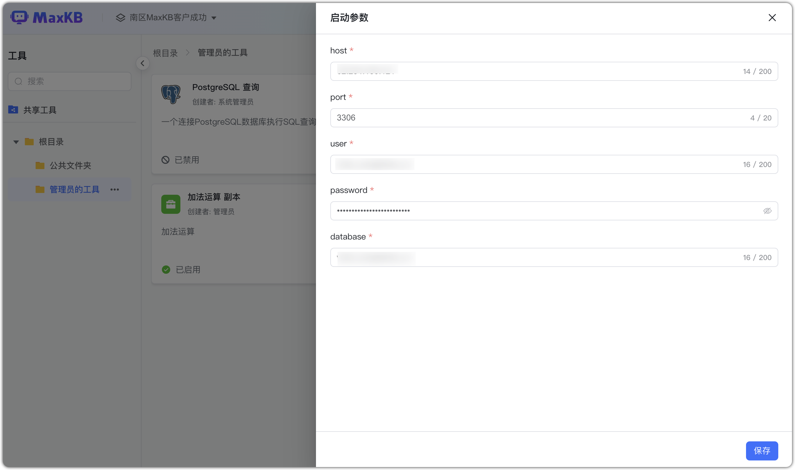
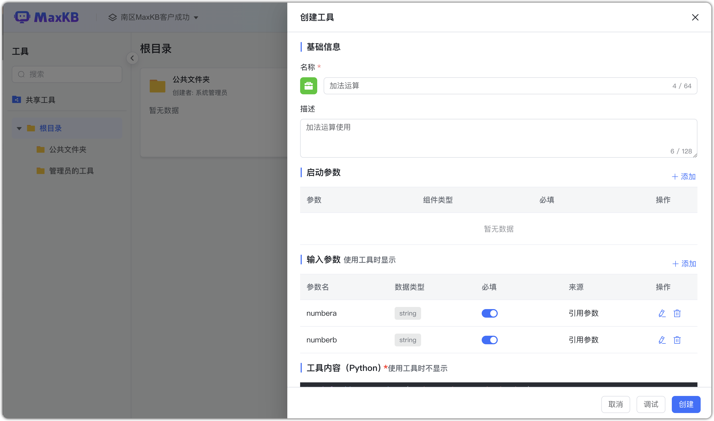
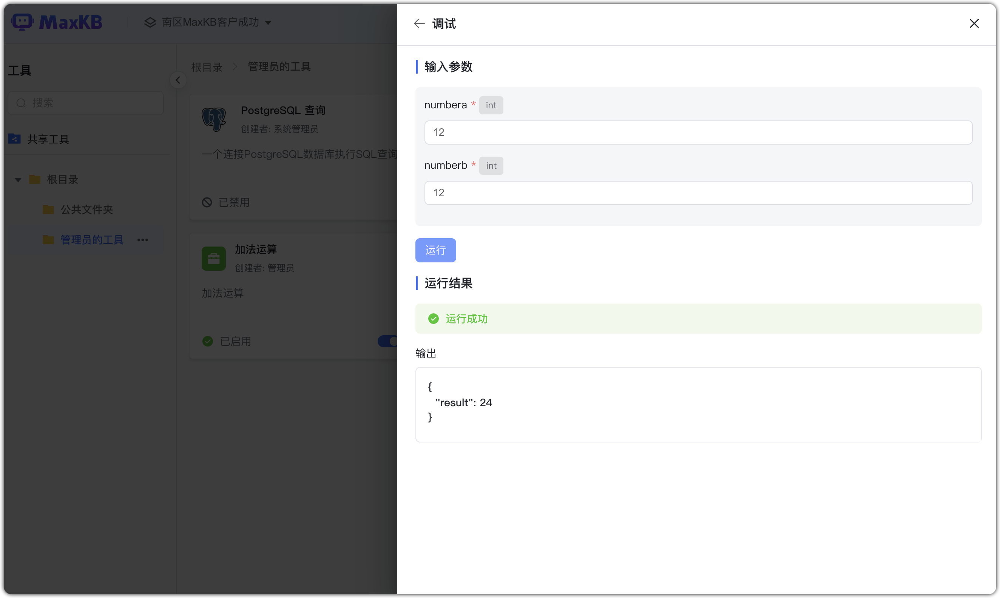
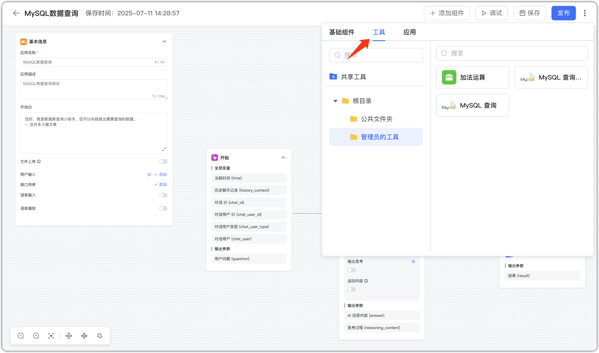
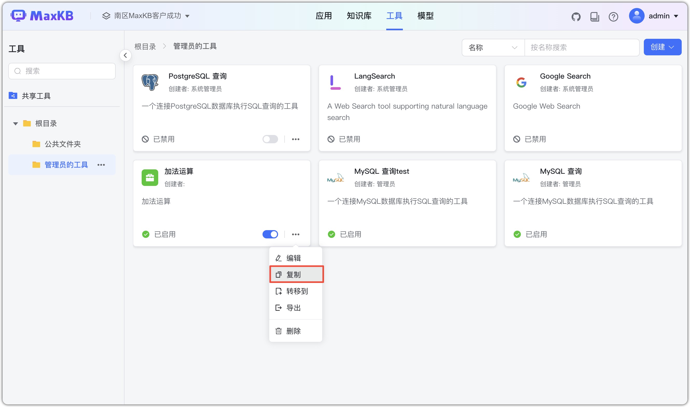
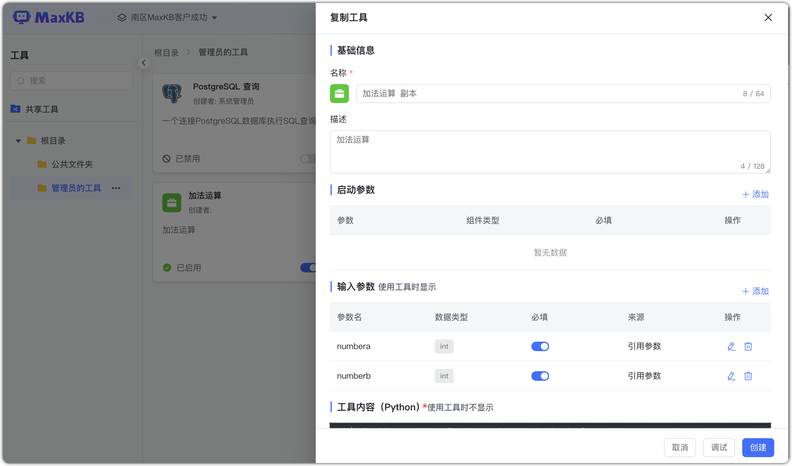
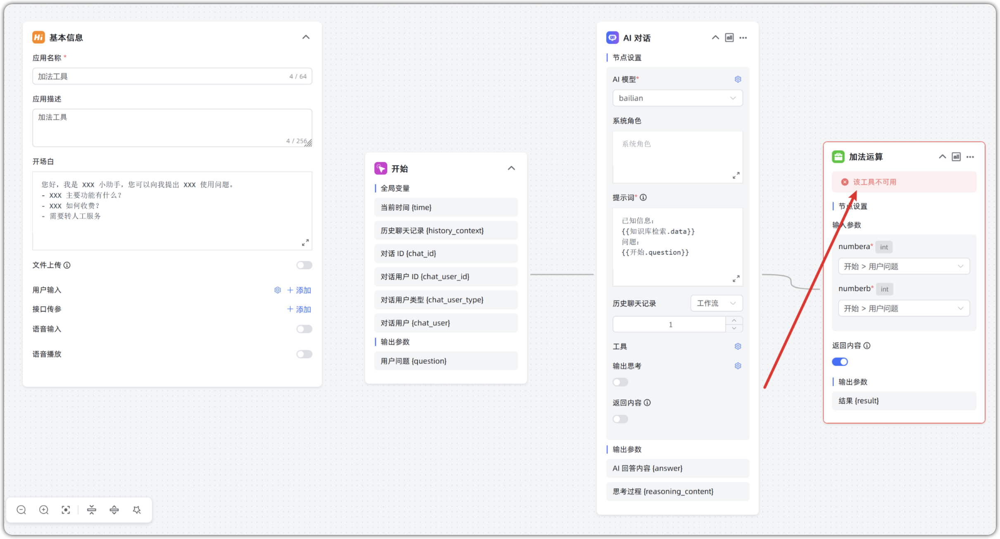

# Инструменты

## 1 Обзор функций

MaxKB позволяет выполнять получение и запрос данных, логические проверки, извлечение информации и др. с помощью встроенных и пользовательских инструментов.  
После создания инструменты подключаются как компоненты в оркестрации приложений, закрывая сложные бизнес‑сценарии. 

- Общие инструменты: администратор создаёт общий инструмент в «Общих ресурсах» и выдаёт права рабочим пространствам.
- Все инструменты: пользователь может создать инструмент; другие пользователи могут просматривать/использовать/поддерживать после [**назначения прав**](../../user_manual/X-Pack/authorization_resources.md).

 **Важно**: общие ресурсы — функция X‑Pack (enterprise).


## 2 Магазин инструментов

Магазин инструментов — модуль MaxKB для расширения функциональности.  
Основные категории:

- Поиск в сети: Google Search, 博查, LangSearch и др., быстрый доступ к информации из интернета.
- Запросы к БД: подключение к разным БД и выполнение запросов (MySQL, PostgreSQL и др.) для управления и анализа данных.





После добавления встроенного инструмента настройте стартовые параметры (подключение к БД, API Key и т.п.) и включите его, чтобы использовать в продвинутой оркестрации.




## 2 Пользовательские инструменты

### 2.1 Установка зависимостей

Если для инструмента нужны сторонние зависимости, установите их в контейнере MaxKB через pip.

```
# 进入 MaxKB 容器中
docker exec -it maxkb bash

# pip安装第三方依赖，如 pymysql，执行下面命令
pip install pymysql 
```

### 2.2 Создание инструмента

Нажмите «Создать инструмент», чтобы открыть диалог создания.

- Имя: логотип ориентируется на имя, можно загрузить свой после сохранения.     
- Описание: подробности и примечания, отображаются в списке компонентов оркестрации.
- Стартовые параметры: необходимые для выполнения (например, API Key). Отделяются от входных, чтобы не раскрывать секреты и фокусироваться на входе в процессе.
- Входные параметры: string, int, float, array; можно задавать вручную или ссылаться на параметры.
- Содержимое функции: ваш Python‑код инструмента, может использовать входные переменные.  
- Выходные параметры: результат выполнения Python‑кода.


{width="600px"}

После написания Python‑кода нажмите «Отладка» для проверки. Затем «Создать» — инструмент готов.  



Готовые инструменты добавляйте через «Продвинутая оркестрация» → «Добавить компонент» → «Инструмент».



## 3 Экспорт/импорт инструментов
    
Доступны экспорт и импорт. Суффикс файла: `.tool`.


    

## 4 Копирование инструмента

Нажмите «Копировать» на панели инструмента, отредактируйте и нажмите «Создать», чтобы быстро получить копию.





## 5 Удаление инструмента

Нажмите «Удалить» на панели инструмента.


**Важно:** если инструмент удалён, а приложение его использует, в оркестрации появится «Инструмент недоступен», а при Q&A возникнет ошибка. 


